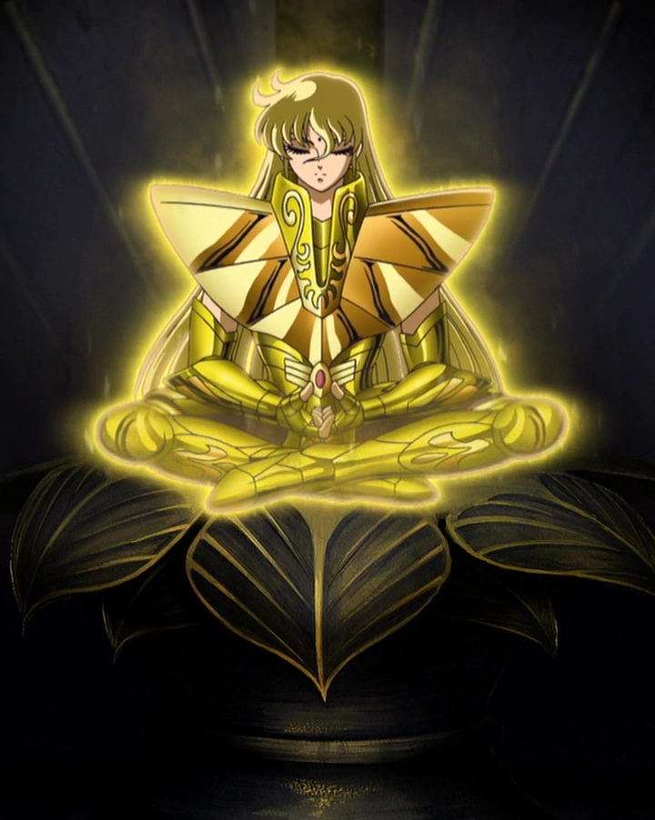

# Virgo No Shaka

Shaka (シャカ, Shaka) es el Santo de Oro de Virgo en la obra Saint Seiya y protege la Casa de la Virgen en el Santuario de Atenea. Es considerado por sus aliados como la reencarnación de Buda, pero realmente Buda es su mentor. Posee un poder de observación que le permite conocer la verdad escondida entre las apariencias.

Perdió la vida a causa de la destructiva Exclamación de Atenea ejecutada por Saga, Shura y Camus, con el fin de, mediante su Octavo Sentido, poder acompañar a Atenea en el Mundo de los Muertos. Finalmente, murió junto con los demás Santos de Oro para romper el Muro de las Lamentaciones. 

@Author Marco A. Gallegos
@Date 2020/08/23
@Description
    un poco de lore para el palacio mental